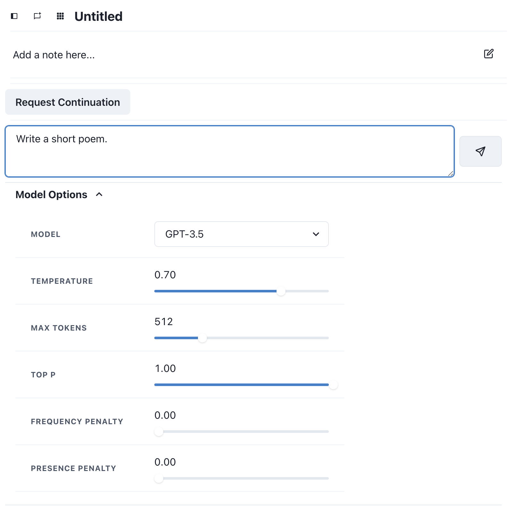
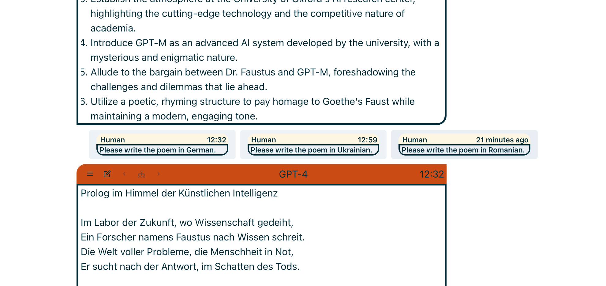
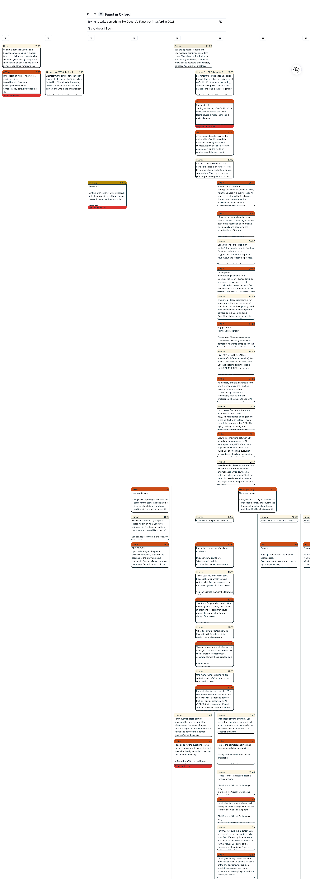

# Chat Playground

[](https://twitter.com/intent/follow?screen_name=blackhc)
[](https://pypi.org/project/chatplayground/)
[](https://pypi.org/project/chatplayground/)
[](https://github.com/blackhc/chatplayground/actions/workflows/dev.yml)
[](https://codecov.io/github/blackhc/chatplayground)


A simple local chat playground with power user features. All messages are stored as JSON files in a local directory, making it easy to sync them with a cloud service like Dropbox or Google Drive and access them from multiple devices while protecting your privacy.

## Motivation

The ChatGPP web app is a great way to play with LLMs, but it has a few limitations:

- It's not possible to edit messages without deleting everything below.
- It's hard to see what the explored alternatives are for a given message.
- It's hard to see what the explored alternatives are for a given message thread.
- It's not possible to change the model settings or the model type (GPT3.5/4) later on.

## Installation

To install Chat Playground, first, make sure you have Node.js installed. You can use `conda` to install Node.js as follows:

```
conda install -c conda-forge nodejs
```

Or, to install a specific version of Node.js (this one worked for me):

```
conda install -c conda-forge nodejs=18.15.0=h26a3f6d_0
```

Once Node.js is installed, you can install Chat Playground using `pip` or `pipx` (if you have nodejs available in your base environment):

```
pipx install chatplayground
```

Ensure that your OpenAI key is set in an OPENAI_API_KEY environment variable. You then can run the playground with

```
chatplayground
```

## Documentation

* Official Documentation: <https://blackhc.github.io/chatplayground>
* Source Code: <https://github.com/blackhc/chatplayground>
* PyPI Package: <https://pypi.org/project/chatplayground/>
* License: GPL-3.0-only

## Features

* Preview of possible alternative message threads as an exposee view.
* Preview of possible alternatives at the message level.
* Editing messages within a message thread without deleting everything below.
* Forking message threads (similar to the ChatGPT web app).
* Messages stored as JSON files in a local directory.
* Easy sync with cloud services like Dropbox or Google Drive.
* Real-time updates from the filesystem to the UI.
* Atomic changes of the stored messages.

## Screenshots







## Code & Layout

This project was written in ~25 hours using [Pynecone](https://pynecone.io/). The code is currently in one big Python file, which may benefit from refactoring into a package with multiple files. However, the code is mostly simple and it was quite productive to keep everything together.

There are a few issues with the current code (in part due to Pynecone's early stage of development):

- No tests currently.
- Calling event functions in State classes requires passing self, even though it shouldn't: `self.state_event_function(self)`.
- Issues with streaming events from the OpenAI request to the UI, requiring a hacky workaround for updates to propagate to the UI correctly.
- Known Pynecone issues, as mentioned in the code.

Despite these issues, the project came together very quickly with PyneCone and works quite well.

## Contributing

Bug fixes, feature requests, and pull requests are welcome! If you have any questions or suggestions, please open an issue on GitHub.

## License

Chat Playground is licensed under AGPL3.0. If you require a commercial license for any part of the project, please contact the author.

Hopefully, this project will inspire new UX paradigms for working with LLMs in the future.

## Credits

This package was created using [PyneCone](https://pynecone.io/) with [Cookiecutter](https://github.com/audreyr/cookiecutter) and the [waynerv/cookiecutter-pypackage](https://github.com/waynerv/cookiecutter-pypackage) project template.

